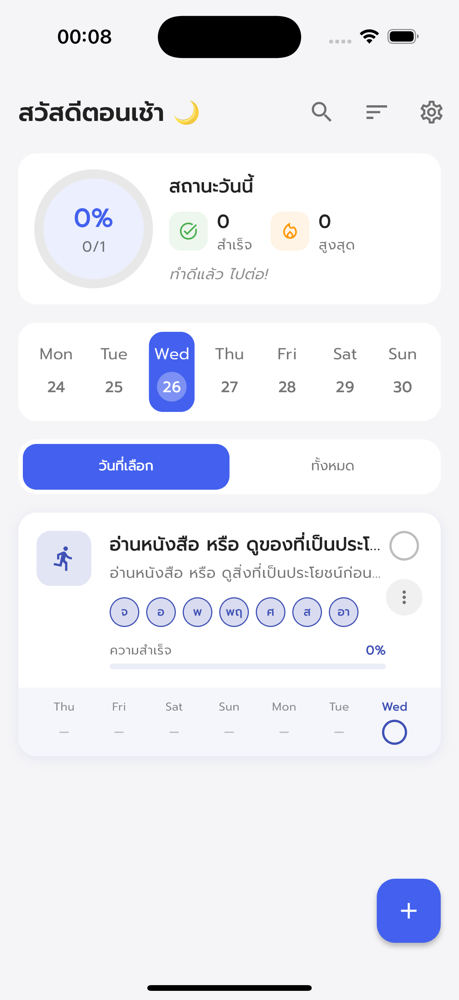
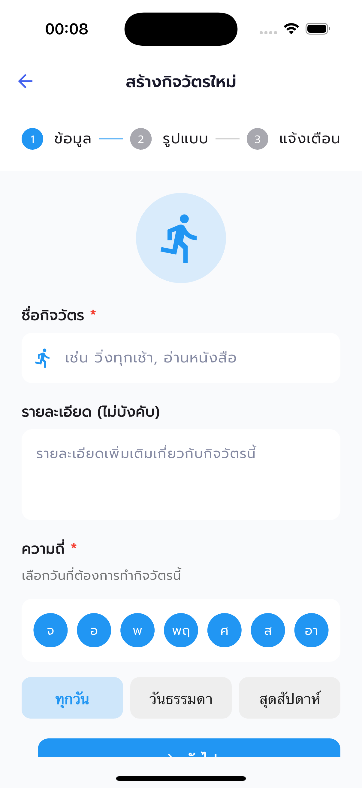
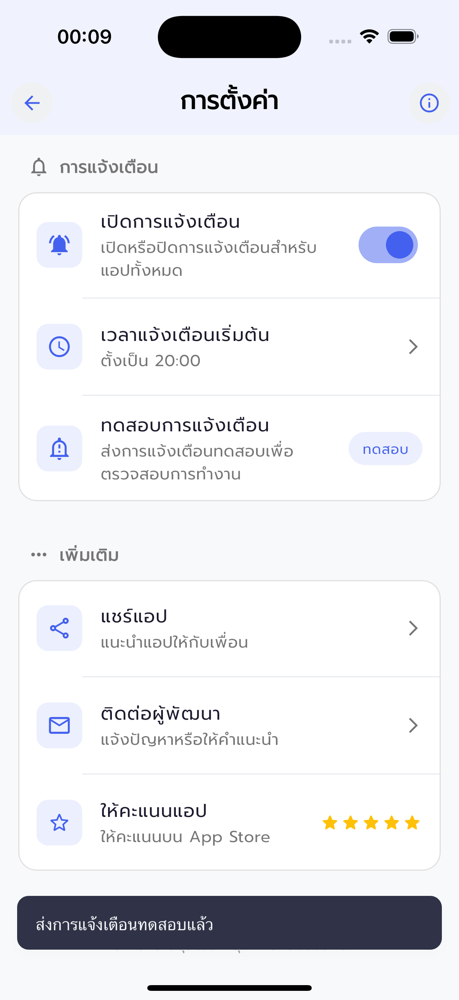
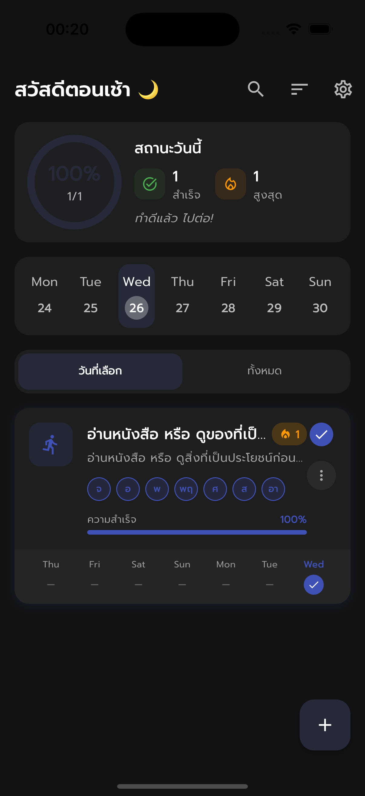
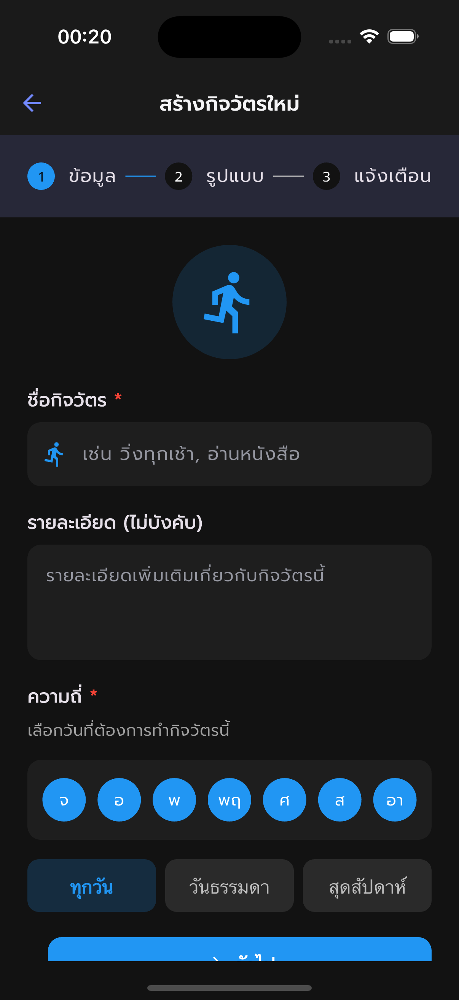
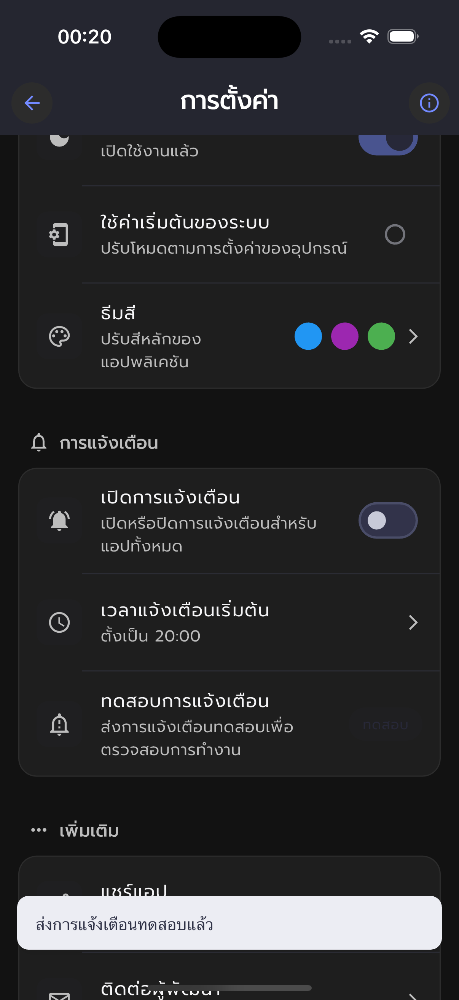

# แอปพลิเคชันติดตามกิจวัตร (Habit Tracker)

แอปพลิเคชันติดตามกิจวัตร เป็นแอปที่ช่วยให้ผู้ใช้สามารถสร้าง ติดตาม และรักษากิจวัตรประจำวันได้อย่างมีประสิทธิภาพ พร้อมด้วยการแจ้งเตือนเพื่อช่วยให้ผู้ใช้สามารถรักษาความสม่ำเสมอในการทำกิจวัตรของตนเอง

## ภาพหน้าจอแอปพลิเคชัน

<!-- markdownlint-disable MD033 -->
<p align="center">
  
  
  
   
  
  
</p>
<!-- markdownlint-enable MD033 -->

## คุณสมบัติ

- **สร้างและจัดการกิจวัตร**: ผู้ใช้สามารถสร้าง แก้ไข และลบกิจวัตรได้
- **กำหนดสีให้กับกิจวัตร**: ปรับแต่งสีของกิจวัตรเพื่อให้จำแนกได้ง่าย
- **ระบบการแจ้งเตือน**: ตั้งค่าการแจ้งเตือนเพื่อเตือนความจำให้ทำกิจวัตรในเวลาที่กำหนด
- **ติดตามความสม่ำเสมอ**: แสดงสถิติการทำกิจวัตรและความต่อเนื่อง (streak)
- **ภาพรวมสถิติ**: แสดงข้อมูลสรุปเกี่ยวกับจำนวนกิจวัตรทั้งหมด กิจวัตรที่ทำเสร็จในวันนี้ และสถิติสูงสุด
- **อินเทอร์เฟซภาษาไทย**: ใช้งานง่ายด้วยอินเทอร์เฟซภาษาไทยทั้งหมด

## การติดตั้ง

1. **ติดตั้ง Flutter และ Dart SDK**  
   ทำตามคำแนะนำในเว็บไซต์ทางการ: [flutter.dev](https://flutter.dev/docs/get-started/install)

2. **โคลนโปรเจกต์**  
   ใช้คำสั่ง:

   ```bash
   git clone https://github.com/AnuwatThisuka/habit-tracker-app
   ```

3. **เข้าไปยังไดเรกทอรีของโปรเจกต์**  

   ```bash
   cd habit-tracker-app
   ```

4. **ติดตั้ง dependencies**  
   รันคำสั่ง:

   ```bash
   flutter pub get
   ```

5. **รันแอป**  
   ใช้คำสั่ง:

   ```bash
   flutter run
   ```

## การใช้งาน

1. เปิดแอปและสร้างกิจวัตรใหม่โดยกดปุ่ม "เพิ่มกิจวัตร"
2. ตั้งชื่อกิจวัตร เลือกสี และกำหนดเวลาแจ้งเตือน
3. ติดตามความสม่ำเสมอของกิจวัตรผ่านหน้าสถิติ
4. รับการแจ้งเตือนเพื่อช่วยให้คุณไม่พลาดกิจวัตรสำคัญ

## การสนับสนุน

หากพบปัญหาหรือมีข้อเสนอแนะ สามารถเปิด Issue ได้ที่ [GitHub Repository](https://github.com/anuwatthisuka/habit-tracker-app/issues)

## ใบอนุญาต

โปรเจกต์นี้อยู่ภายใต้ลิขสิทธิ์ [MIT License](LICENSE)
